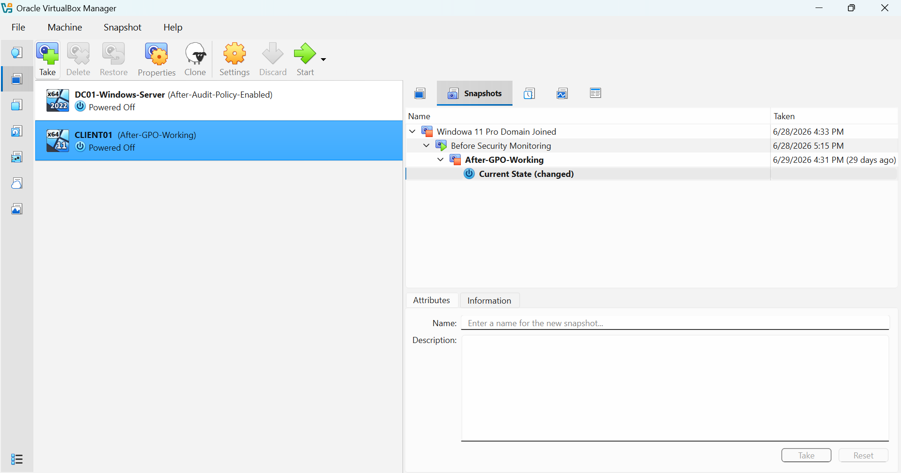

# Environment Setup

## Objective

The goal of this project is to build an enterprise-style cybersecurity home lab that simulates a real-world Windows domain environment.

The lab is designed to practice:

- Windows Server administration
- Active Directory management
- Group Policy configuration
- Endpoint management
- Security monitoring
- Threat detection

---

## Lab Architecture

The environment consists of:

| System | Purpose |
|---|---|
| DC01 | Windows Server Domain Controller |
| Client01 | Windows 11 domain-joined workstation |

---

## Virtualization Platform

The lab was created using:

- Oracle VirtualBox

Virtual machines:

- Windows Server 2025 (Server Core)
- Windows 11 Pro

---

## Virtual Machine Overview

The lab environment contains a dedicated Domain Controller and Windows client machine.

---

## Current Progress

Completed:

- ✅ VirtualBox environment setup
- ✅ Windows Server installation
- ✅ Windows 11 client installation
- ✅ Active Directory deployment
- ✅ Domain configuration
- ✅ DNS configuration
- ✅ User management
- ✅ Organizational Units
- ✅ Domain joining
- ✅ Group Policy configuration

Upcoming:

- ⏳ Sysmon deployment
- ⏳ Splunk Enterprise integration
- ⏳ Windows event monitoring
- ⏳ Attack simulation
- ⏳ Detection engineering
- ⏳ MITRE ATT&CK mapping
