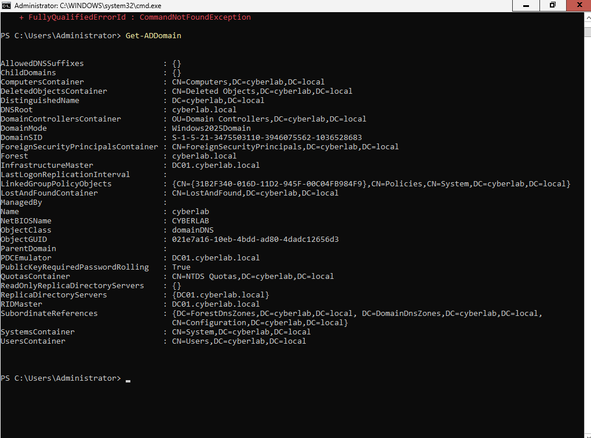

# Active Directory Installation

## Objective

The objective of this phase was to deploy and configure Active Directory Domain Services (AD DS) on Windows Server 2025 and create an enterprise-style Windows domain environment.

## Environment

- Operating System: Windows Server 2025 (Server Core)
- Domain Name: `cyberlab.local`
- Role: Domain Controller
- Services:
  - Active Directory Domain Services
  - DNS Server

---

## Active Directory Domain Configuration

The domain was successfully created and configured as:

```
cyberlab.local
```



---

## Domain Controller Verification

The Domain Controller was verified using PowerShell commands.

Command used:

```powershell
Get-ADDomainController
```


---

## Installed Windows Server Roles

The following roles were installed:

- Active Directory Domain Services
- DNS Server

Command used:

```powershell
Get-WindowsFeature | Where Installed
```


---

## User Management

Multiple Active Directory user accounts were created to simulate an enterprise environment.

Examples:

- Administrator account
- shreya.bista
- john.employee

Command used:

```powershell
Get-ADUser -Filter *
```


---

## Organizational Units

Organizational Units were created to organize users and simulate enterprise account management.

Command used:

```powershell
Get-ADOrganizationalUnit -Filter *
```


