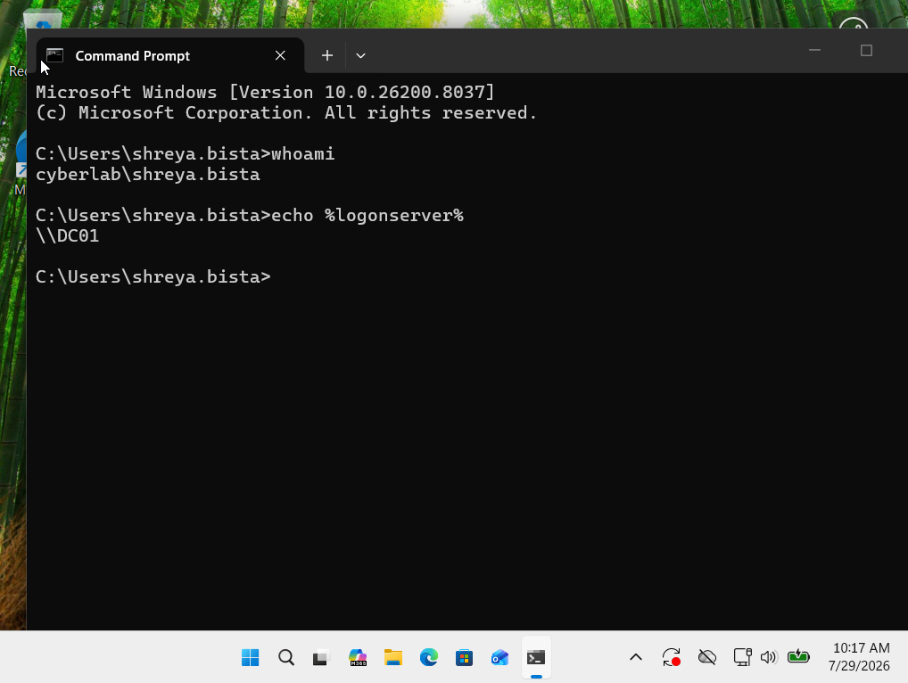

# Domain Join

## Objective

The objective of this phase was to connect a Windows 11 workstation to the Active Directory domain and verify successful domain authentication.

---

## Client Configuration

The Windows 11 Pro workstation was configured as a domain-joined endpoint in the `cyberlab.local` environment.

Client:

```
Client01
```

Domain:

```
cyberlab.local
```

---

## Domain Membership Verification

The workstation was verified to be successfully joined to the Active Directory domain.


---

## Domain User Authentication

A domain user account was used to authenticate on the Windows 11 workstation.

Example:

```
CYBERLAB\shreya.bista
```

Authentication was verified using:

```cmd
whoami
```


---

## Domain Controller Communication

The workstation was verified to communicate with the Domain Controller.

Command used:

```cmd
echo %logonserver%
```

This confirmed that authentication requests were being handled by the domain controller.



---

## Network Configuration

The client workstation was configured with the correct network settings to communicate with Active Directory services.

Verified:

- IP Address
- DNS Configuration
- Domain connectivity

Command used:

```cmd
ipconfig /all
```


---

## Result

The Windows 11 workstation successfully joined the Active Directory domain and authenticated using domain credentials.

This confirms:

- Successful domain join
- Active Directory authentication
- Client-to-domain controller communication
