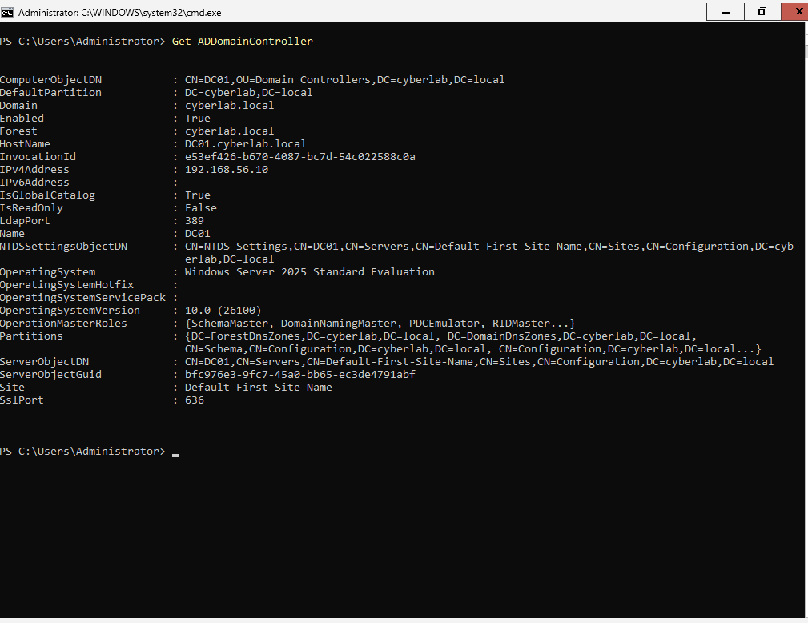
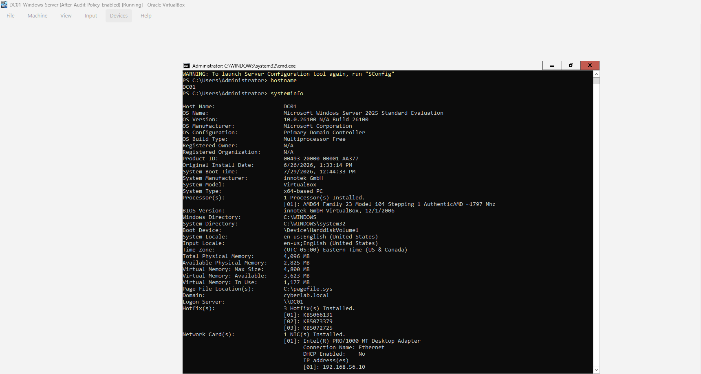
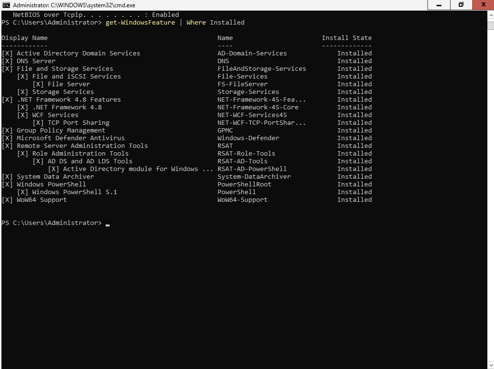
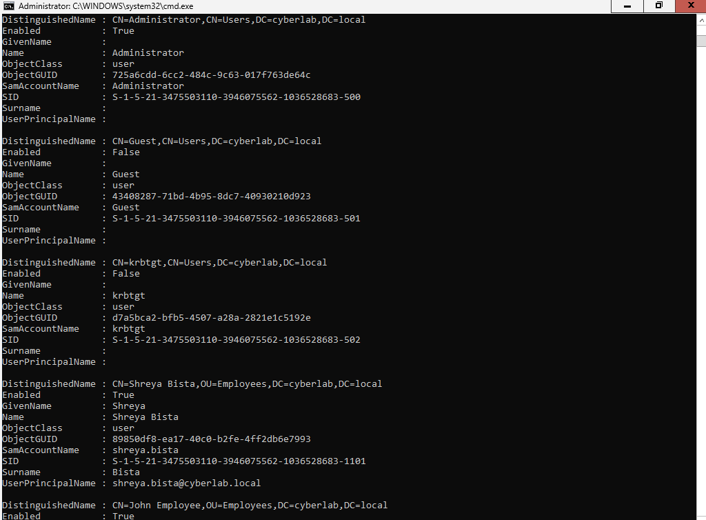
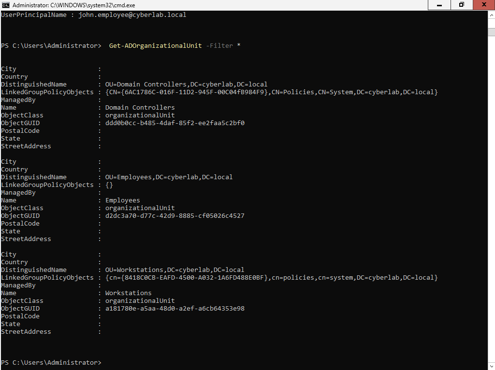
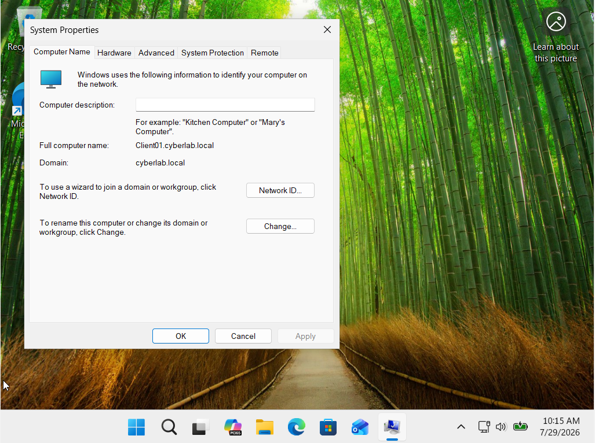
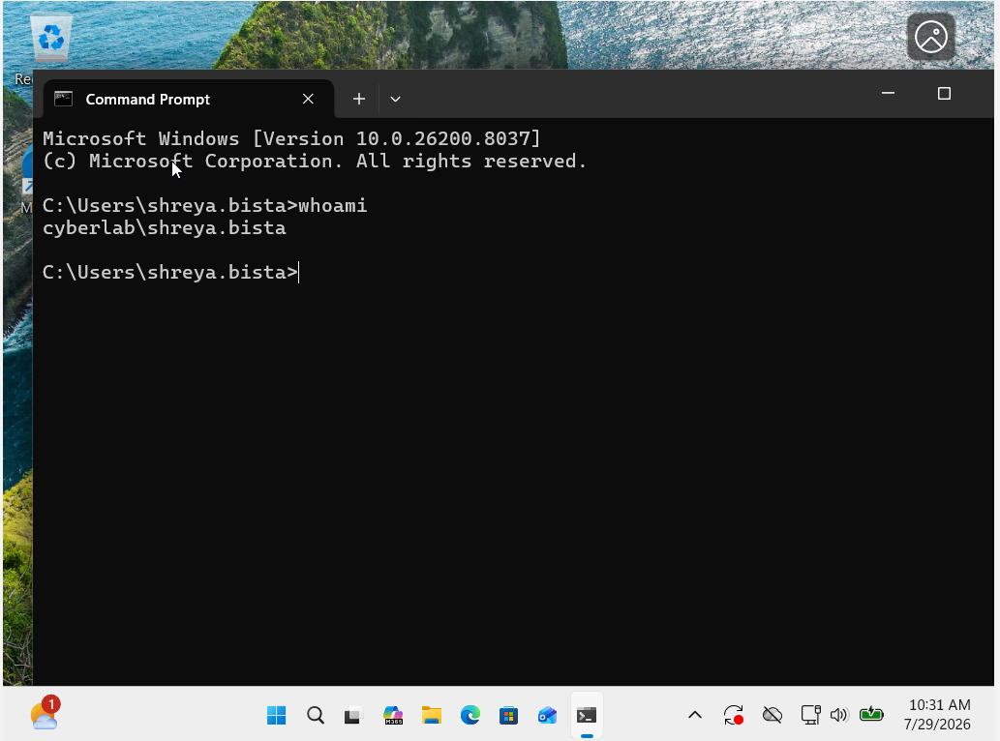
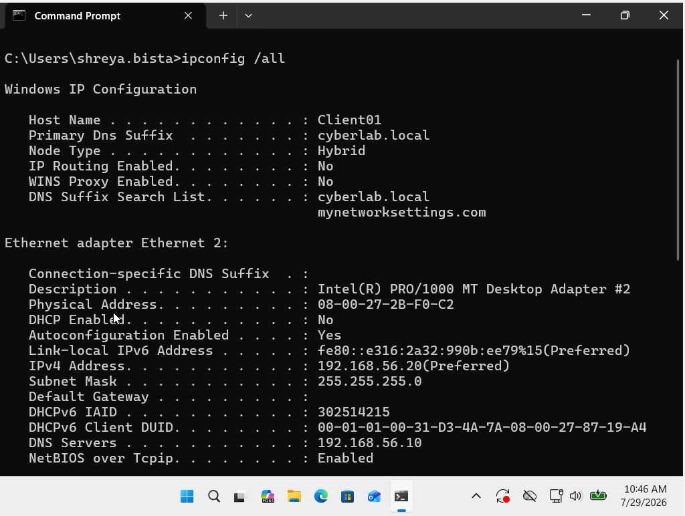

# Active Directory SOC Home Lab

🚧 **Status: Work in Progress**

A hands-on cybersecurity home lab designed to simulate an enterprise Windows environment and develop practical SOC analyst skills through Active Directory administration, endpoint management, security monitoring, and threat detection.

---

# Project Overview

This project documents the development of an enterprise-style cybersecurity lab environment built from the ground up.

The goal is to gain practical experience with:

- Windows Server administration
- Active Directory management
- Identity and Access Management (IAM)
- Group Policy security controls
- Endpoint configuration
- Security monitoring
- Threat detection
- Incident response workflows

The current phase focuses on building the Windows enterprise foundation. Future phases will expand this environment into a complete SOC simulation using SIEM tools, attack simulations, and detection engineering.

---

# Lab Architecture

```
                    cyberlab.local
                          |
                          |
          Windows Server 2025 (DC01)
              Domain Controller
          AD DS + DNS + PowerShell
                          |
                          |
              ---------------------
                          |
                          |
             Windows 11 Pro (Client01)
              Domain Joined Endpoint
```

---

# Technologies Used

## Infrastructure

- Windows Server 2025 (Server Core)
- Windows 11 Pro
- Oracle VirtualBox

## Active Directory

- Active Directory Domain Services (AD DS)
- DNS
- PowerShell Administration
- User Management
- Organizational Units (OUs)
- Group Policy Objects (GPO)

## Security Operations (Upcoming)

- Splunk Enterprise
- Sysmon
- Windows Security Event Monitoring
- SIEM Analysis
- MITRE ATT&CK Framework
- Attack Simulation
- Detection Engineering

---

# Completed Work

## ✅ Active Directory Deployment

Built and configured a Windows enterprise domain environment.

Completed:

- Installed Active Directory Domain Services
- Promoted Windows Server to Domain Controller
- Created `cyberlab.local` domain
- Configured DNS services
- Verified Domain Controller functionality

### Domain Controller Verification



---

## ✅ Windows Server Configuration

Configured and verified the Windows Server environment using PowerShell.

Completed:

- Server configuration
- Network configuration
- Installed server roles verification
- Active Directory validation

### Server Information



### Installed Roles



---

## ✅ Active Directory User Management

Created and managed domain users and organizational structure.

Implemented:

- Domain user accounts
- Organizational Units
- User organization and management

### Domain Users



### Organizational Units



---

## ✅ Windows 11 Domain Integration

Configured a Windows 11 Pro endpoint and successfully joined it to the Active Directory domain.

Verified:

- Domain membership
- Domain authentication
- Communication with Domain Controller

### Domain Membership



---

## ✅ Domain Authentication Verification

Validated authentication using an Active Directory domain account.

Example:

```
CYBERLAB\shreya.bista
```

Verification command:

```cmd
whoami
```

### Authentication Verification



---

## ✅ Network Configuration

Verified endpoint connectivity and Active Directory DNS configuration.

Command used:

```cmd
ipconfig /all
```

### Client Network Configuration



---

# Project Documentation

Detailed documentation for each phase of the lab:

## Environment Setup

Virtual machine deployment and initial lab configuration.

➡️ [View Environment Setup](01-Environment-Setup/setup.md)

---

## Active Directory Configuration

Domain Controller deployment, DNS configuration, user management, and Organizational Units.

➡️ [View Active Directory Documentation](02-Active-Directory/active-directory.md)

---

## Domain Join

Windows 11 endpoint integration and Active Directory authentication verification.

➡️ [View Domain Join Documentation](03-Domain-Join/domain-join.md)

---

## Group Policy Configuration

Security policies and centralized endpoint management.

➡️ [View Group Policy Documentation](04-Group-Policy/group-policy.md)

---

# Security Skills Demonstrated

This project demonstrates hands-on experience with:

✅ Windows Server Administration  
✅ Active Directory Deployment  
✅ Identity and Access Management  
✅ Domain Authentication  
✅ PowerShell Administration  
✅ DNS Configuration  
✅ User and Access Management  
✅ Group Policy Configuration  
✅ Endpoint Management  
✅ Cybersecurity Lab Development  

---

# Future Development Roadmap

## Phase 2: SOC Monitoring Environment ⏳

Planned additions:

- [ ] Enable advanced Windows auditing
- [ ] Deploy Sysmon
- [ ] Configure Windows event collection
- [ ] Integrate Splunk Enterprise
- [ ] Monitor authentication events
- [ ] Detect brute-force attacks
- [ ] Create detection rules
- [ ] Perform security investigations
- [ ] Map activity to MITRE ATT&CK techniques

---

# Related Cybersecurity Projects

Other hands-on security projects:

- Microsoft Sentinel Failed Login Detection Lab
- Splunk Windows Authentication Monitoring & Brute Force Detection Lab
- Python Security Log Analyzer
- Wireshark Malware Traffic Analysis

---

# About Me

**Shreya Bista**

Cybersecurity Graduate | CompTIA Security+ Certified

Interested in Security Operations, Threat Detection, and Defensive Security Engineering.
