# Active Directory SOC Home Lab

**Status: Complete (GUI build)**

A hands-on Security Operations home lab. I built a small Windows Active Directory environment, attacked it on purpose with an RDP brute force, and then detected and investigated the attack using Windows event logs and Splunk.

This version was built using the Windows graphical tools (Server Manager, Active Directory Users and Computers, and Group Policy Management), so every step can be followed by clicking through the interface.

---

## 1. Project Overview

**Objective:** Build an enterprise-style Windows environment, run a controlled attack against it, and prove a full detection pipeline. The loop is simple: an event happens, it gets logged, it gets collected into a SIEM, it gets investigated, and it becomes a repeatable detection.

**Skills shown:** Windows Server administration, Active Directory, identity and access management, Group Policy security, endpoint configuration, SIEM log collection, threat detection, and incident response.

**Phases:**
- **Phase 1:** Active Directory foundation, a domain-joined endpoint, users and OUs, and Group Policy.
- **Phase 2:** a simulated attacker, Windows security auditing, Splunk log collection, detection searches, a dashboard, and MITRE ATT&CK mapping.

---

## 2. Lab Architecture

All machines run in Oracle VirtualBox on an isolated internal network named `intnet`. Splunk Enterprise runs on the host laptop.

| Machine | Role | OS | IP |
|---|---|---|---|
| DC01 | Domain Controller (AD DS, DNS) | Windows Server 2025 (GUI) | 192.168.10.10 |
| client01 | Domain-joined workstation | Windows 11 Pro | 192.168.10.20 |
| Kali | Attacker (Nmap, Hydra) | Kali Linux | 192.168.10.30 |
| Laptop host | Splunk Enterprise (SIEM) | Windows | reached at 10.0.2.2 |

**Domain:** `corp.local`

**Data flow:**
- Active Directory and Group Policy serve DC01 and client01.
- The attacker (Kali) runs an RDP brute force against DC01.
- DC01 runs a Splunk Universal Forwarder that sends its Windows Security logs to Splunk on the laptop, over port 9997.

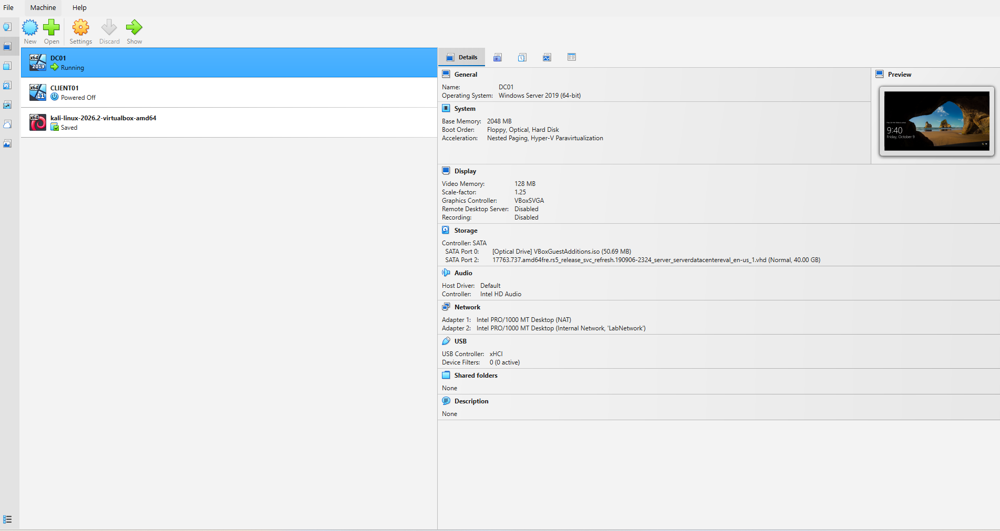

---

## 3. Technologies Used

**Infrastructure:** Windows Server 2025 (Desktop Experience), Windows 11 Pro, Kali Linux, Oracle VirtualBox.

**Active Directory:** AD DS, DNS, Active Directory Users and Computers (ADUC), organizational units, users and groups, Group Policy Management (GPMC).

**Security Operations:** Splunk Enterprise, Splunk Universal Forwarder, Windows security auditing, Windows Security event monitoring, SPL (Splunk Search Processing Language), detection engineering, SOC dashboard building, MITRE ATT&CK, Nmap, Hydra.

---

## 4. Phase 1: Active Directory Foundation (GUI)

Built entirely with the Windows graphical tools.

- Installed the Active Directory Domain Services role with Server Manager and promoted DC01 to a domain controller for a new forest, `corp.local`.
- Set a static IP (192.168.10.10) on the internal network card and configured DNS.
- Created organizational units: IT, HR, Security, and Workstations.
- Created domain users (Alice, Bob, Charlie) and a security group (IT-Security).
- Joined client01 (Windows 11) to the domain and moved it into the Workstations OU.

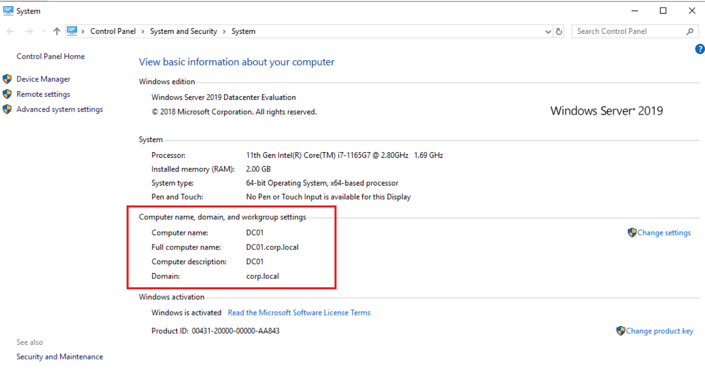
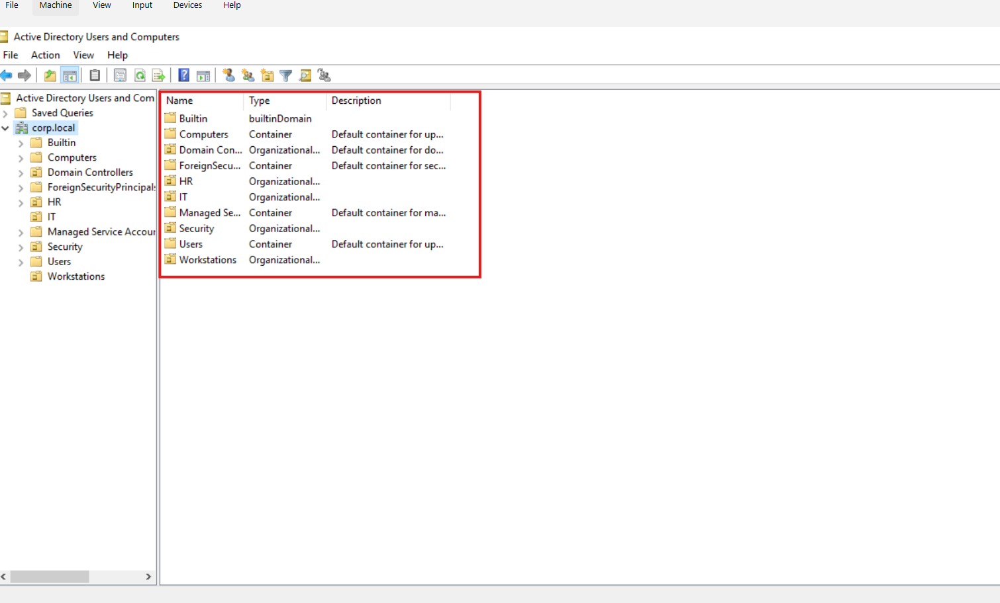
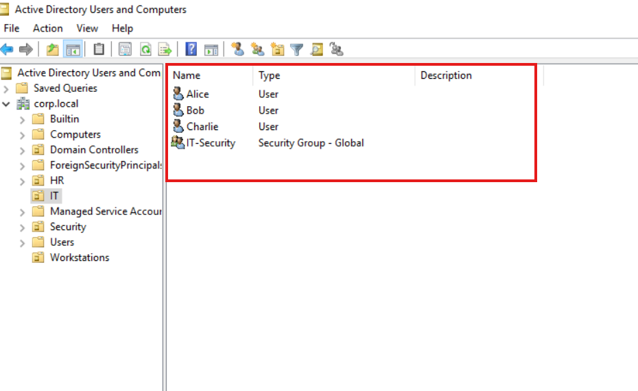

### Account Lockout Policy

A Group Policy (`Lab-Password-and-Lockout-Policy`) locks any account after **5 wrong passwords** for **30 minutes**. This control later stopped the brute-force attack and produced the lockout event. It is an example of defense in depth: the attack was not only detected, it was blocked.

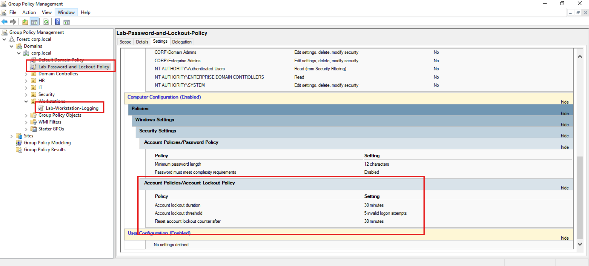

### Access Control (NTFS and Share Permissions)

To practice least privilege, I created a shared folder and limited who could use it.

- Shared `C:\LabShare\IT` as `ITShare`.
- Gave the **IT-Security** group Modify rights (NTFS) and Change rights (share).
- **Alice** is a member of IT-Security, so she could create files in the share.
- **Bob** is not a member, so he was denied.

This demonstrates least privilege: only the right group can write, and everyone else is blocked.

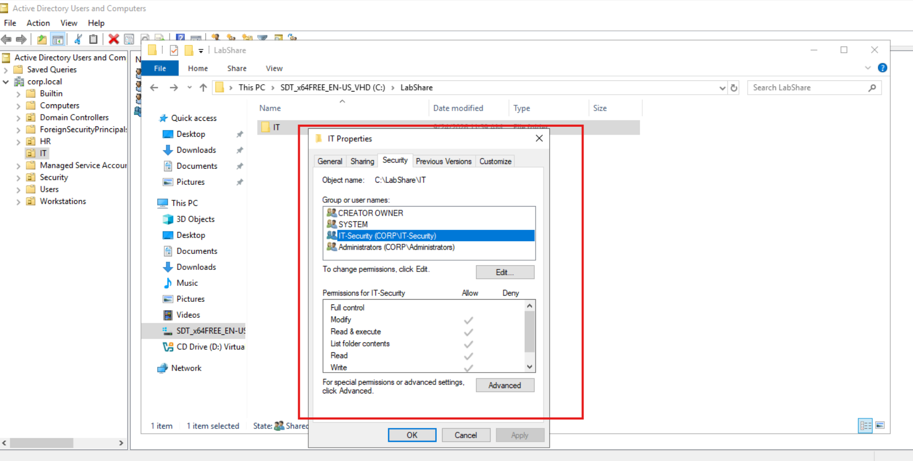
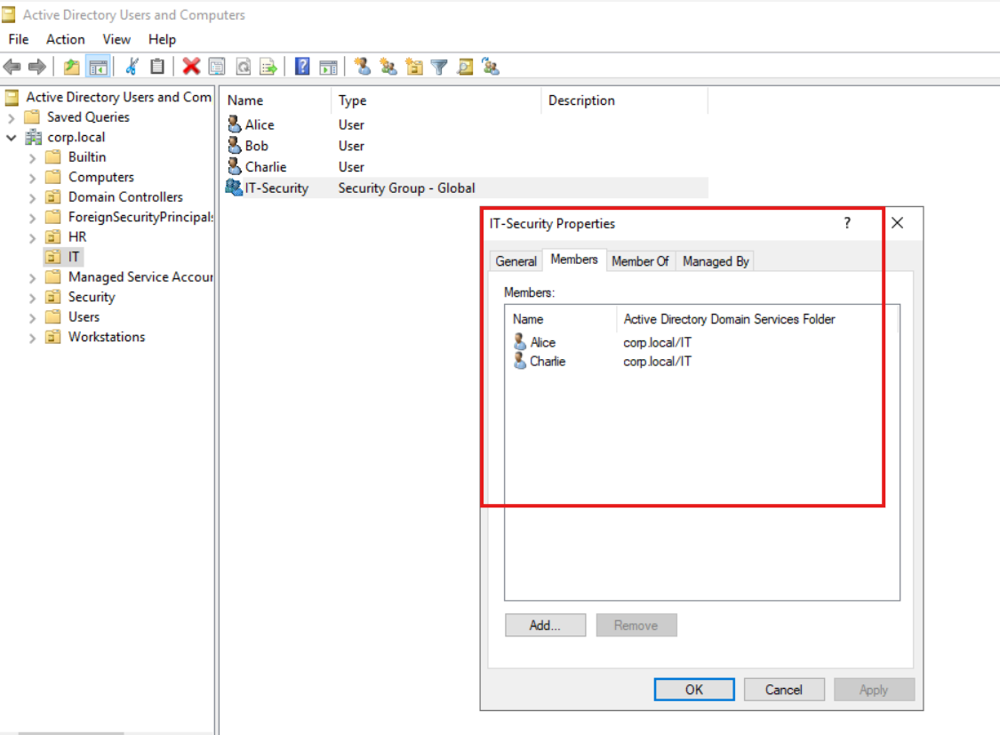

---

## 5. Phase 2: SOC Detection and Monitoring

Pipeline: attacker activity, to Windows Security events, to Splunk, to detection, to a dashboard.

### 5a. Security Auditing

Windows was confirmed to audit logon success and failure, so failed sign-ins are recorded as event 4625.

Checked with:
```
auditpol /get /category:"Logon/Logoff"
```

Key event IDs used in this project:

| Event ID | Meaning |
|---|---|
| 4625 | An account failed to log on |
| 4740 | A user account was locked out |
| 4624 | An account successfully logged on (baseline) |

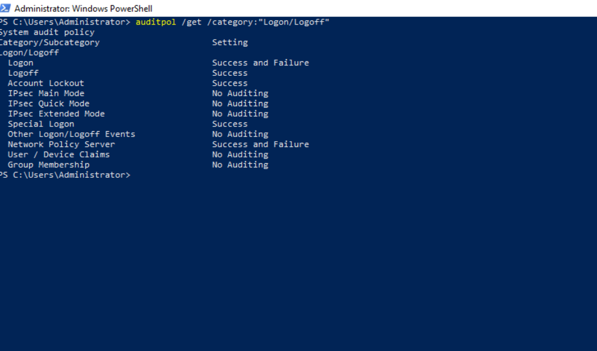

### 5b. Attack Simulation: RDP Brute Force

First I confirmed Remote Desktop was reachable on DC01 with Nmap:
```
nmap -Pn -p 3389 192.168.10.10
```

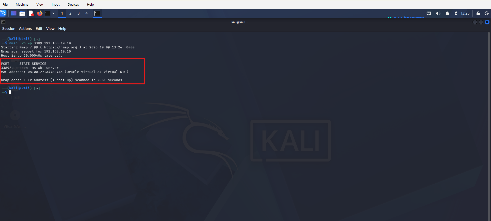

Remote Desktop was then enabled on DC01.

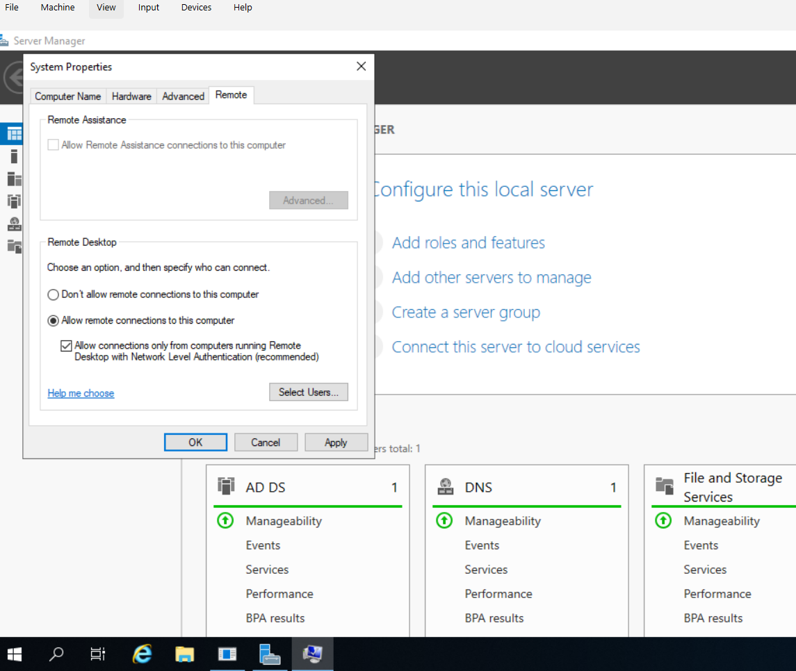

Then I ran a controlled RDP brute force from Kali against the domain user `alice`:
```
hydra -t 1 -V -l alice -P passwords.txt rdp://192.168.10.10
```

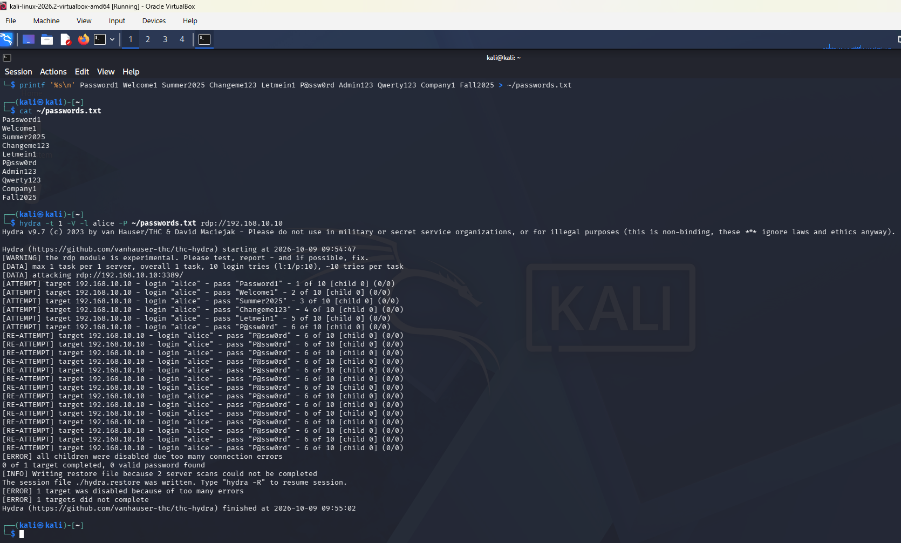

**Result:** After 5 wrong passwords, the account lockout policy locked `alice`, and Hydra could not continue. The attack was both detected and stopped by a security control.

### 5c. Detection in Windows (Event Viewer)

The attack produced **5 failed logon events (4625)** and **1 account lockout event (4740)** on DC01.

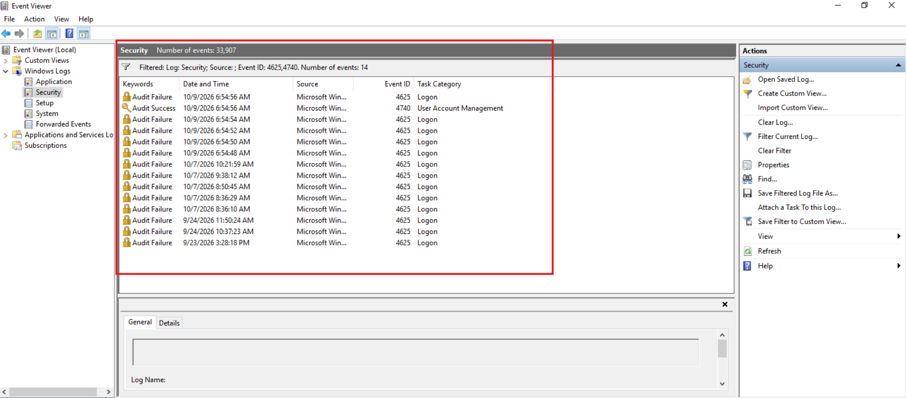

**Note on Logon Type:** Because Network Level Authentication (NLA) is enabled on RDP, the failed logons are recorded as **Logon Type 3 (network)**, not Type 10. NLA checks the password over the network before a full desktop session starts, so brute-force attempts appear as network logons.

### 5d. Splunk Universal Forwarder

A Splunk Universal Forwarder on DC01 ships the Windows Security log to Splunk on the laptop.

- **Output:** send to the laptop at `10.0.2.2` on port `9997` (the VirtualBox host address for a NAT machine).
- **Input:** collect the Windows Security log into the `main` index.
- A Windows Firewall rule on the laptop allows inbound port 9997.

`inputs.conf` on DC01:
```
[WinEventLog://Security]
disabled = 0
index = main
```

`outputs.conf` on DC01:
```
[tcpout]
defaultGroup = default-autolb-group

[tcpout:default-autolb-group]
server = 10.0.2.2:9997
```

**Lesson learned:** The forwarder installer sets up where to send data, but it does not collect any log by itself. I had to add the Security log input by hand. "Installed and running" is not the same as "collecting data."

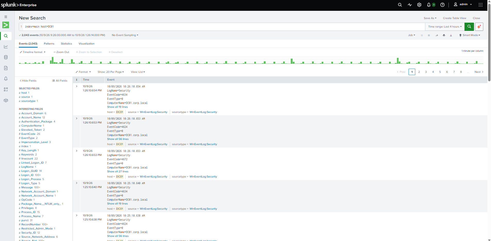

### 5e. Detection Engineering (SPL)

Failed logins and lockouts together:
```
index=main host=DC01 (EventCode=4625 OR EventCode=4740)
```

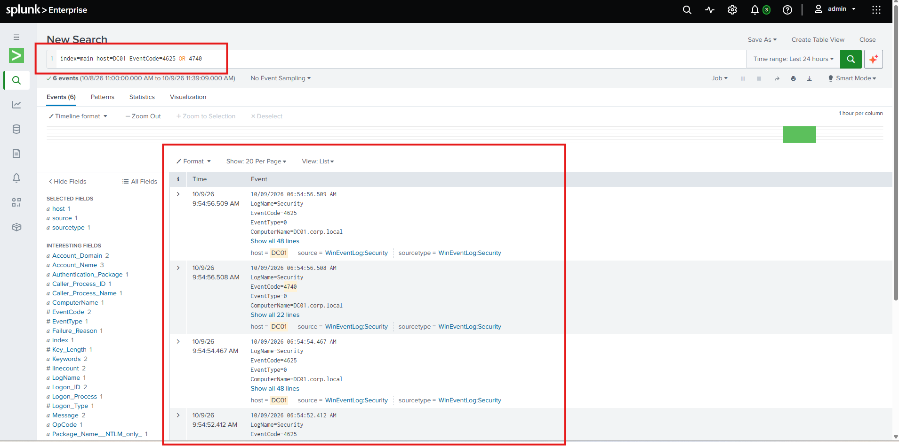

Attack timeline (failed logins per minute):
```
index=main host=DC01 EventCode=4625 | timechart span=1m count as Failed_Logins
```

Most targeted accounts:
```
index=main host=DC01 EventCode=4625 | top Account_Name
```

Failed login details (who, from where, how):
```
index=main host=DC01 EventCode=4625 | table _time, Account_Name, Source_Network_Address, Logon_Type
```

### 5f. SOC Dashboard

A 4-panel dashboard, "SOC Brute Force Detection":
- **Failed Logins Over Time** (shows the attack as a single sharp spike)
- **Top Targeted Accounts**
- **Account Lockouts**
- **Failed Login Details** (including the attacker IP, 192.168.10.30)

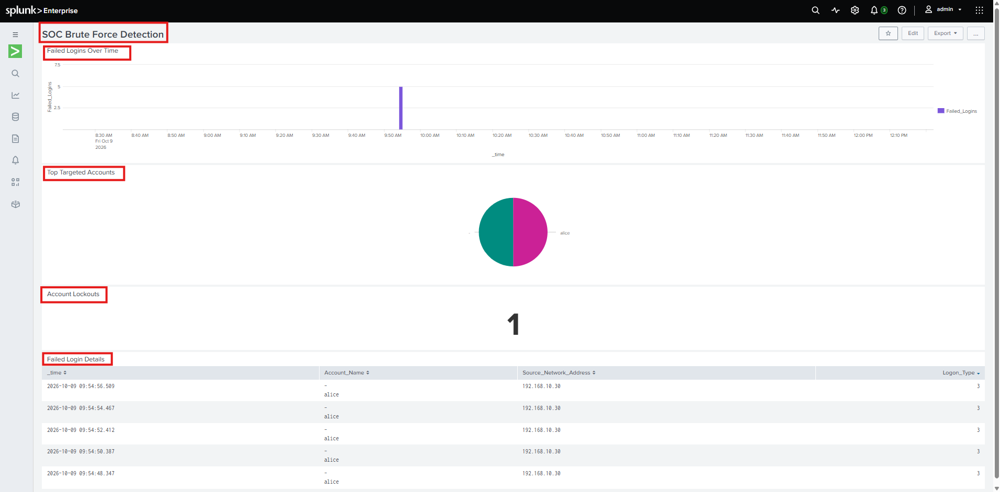

### 5g. Alerting (detection logic)

The detection rule for a brute force is: **5 or more failed logins for one account in 2 minutes.**

Search logic:
```
index=main host=DC01 EventCode=4625
| bucket _time span=2m
| stats count by _time, Account_Name, Source_Network_Address
| where count >= 5
```

**Note:** this lab's Splunk runs on the free license, which does not run live scheduled alerts. The search above is the alert logic. On Splunk Enterprise (or a Splunk developer license) this would be saved as a scheduled alert that runs every few minutes and notifies when the count reaches 5.

### 5h. Incident Response

As the analyst, after confirming the activity was a controlled test, I unlocked the account in ADUC. This is the normal response an analyst performs after a lockout.

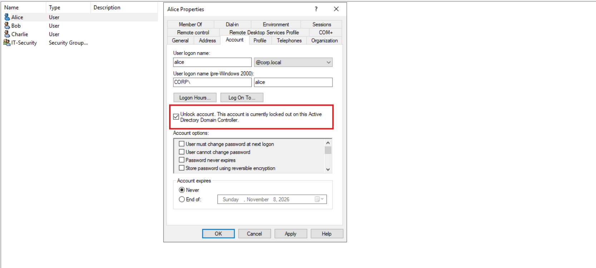

### 5i. MITRE ATT&CK Mapping

| Technique | ID | How it appears in this lab |
|---|---|---|
| Brute Force | T1110 | Repeated password guesses against the domain user `alice` |
| Remote Services: Remote Desktop Protocol | T1021.001 | The attack targeted Remote Desktop (port 3389) on DC01 |

---

## 6. Security Skills Demonstrated

- Windows Server 2025 setup and administration (GUI)
- Active Directory: domain, organizational units, users, groups
- Group Policy: account lockout policy
- NTFS and share permissions (least privilege)
- Domain join and endpoint configuration
- Windows security auditing and event analysis
- Splunk Universal Forwarder deployment and configuration
- Splunk SPL searches and detection engineering
- SOC dashboard building
- Attack simulation with Nmap and Hydra
- MITRE ATT&CK mapping
- Incident response (account unlock)

---

## 7. Roadmap

- [x] Active Directory foundation (GUI)
- [x] Account lockout policy
- [x] RDP brute-force simulation
- [x] Windows event detection (4625, 4740)
- [x] Splunk log collection with a Universal Forwarder
- [x] Detection searches and a SOC dashboard
- [x] MITRE ATT&CK mapping
- [x] Incident response (account unlock)

---

## 8. About Me

**Shreya Bista**
MS in Cybersecurity Operations and Warfare. CompTIA Security+ certified.
Interested in security operations, threat detection, and defensive engineering.
